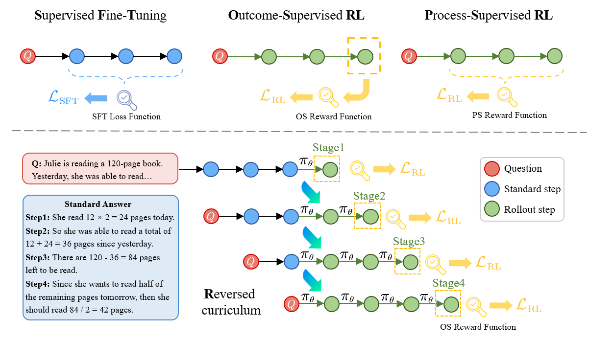

<h1 align="left"><strong>R</strong><sup>3</sup>: Training Large Language Models for <strong>R</strong>easoning through <strong>R</strong>everse Curriculum <strong>R</strong>einforcement Learning</h1>

<space for arxiv badge>
Implementation of the "Training Large Language Models for Reasoning through Reverse Curriculum Reinforcement Learning" presented by Zhiheng Xi, Wenxiang Chen, Boyang Hong, Senjie Jin, Rui Zheng, et al.

## 💡 Introduction



## 🛠️ Set up

It is suggested to use a **python 3.9** environment to run the experiment. Run the following commands to set up your environment:

```
git clone https://github.com/xxxxx.git

conda create -n R3_math python=3.9 -y
cd R3_math/
pip install -r requirements.txt

conda create -n R3_others python=3.9 -y
cd R3_others/
pip install -r requirements.txt
```

## ⚡️Usage

### Step1: SFT Training

To train a sft model, first set the model path and output path in the  `R3_others/scripts/step1_supervised_finetuning/R3_sft.sh`script. Then, run the following command:

```
cd R3_others/scripts/step1_supervised_finetuning/
bash R3_sft.sh
```

### Step2: R$^3$ Training

To train a reinforced model using **R**$^3$ on GSM8K (or other math datasets), first set the actor model path (it should be a sft model checkpoint from **Step1**) and output path in `R3_math/scripts/R3_cot_gsm8k.sh`, and run the following command:

```
cd R3_math/scripts/
bash R3_cot_gsm8k.sh
```

**Note**: If you want to try **R**$^3$ on other datasets like MNLI or race@High, set the SFT model path in `R3_others/scripts/step3_rlhf_finetuning/R3_mix.sh`. Then, run the folloing command:

```
cd R3_others/scripts/step3_rlhf_finetuning/
bash R3_mix.sh
```

### Evaluation

> It is not required for math datasets. Results will be saved in *wandb*.

To evaluate the model performance, first run the evaluation script `R3_others/scripts/eval/eval_single.sh`. Then, get your results in `output_{dataset_name}.py`. Here's an example for MNLI dataset:

```
cd R3_others/scripts/eval
bash eval_single.sh
# after evaluation
# you will get a result file like: eval_mnli/R3_test.txt

python output_mnli.py
# then you will get acc result
```

### Data

For the purpose of security review, we provide some examples of the data, formatted as follows:

```
Dataset: MNLI
	---- mnli_train_example.json # for SFT
	---- mnli_mix_example.json # fot R^3
	---- mnli_test.json
```

## ✏️ Citation

If you find **R**$^3$ useful for your your research and applications, please cite using this BibTeX:

TODO


## Contact
- zhxi22@m.fudan.edu.cn
